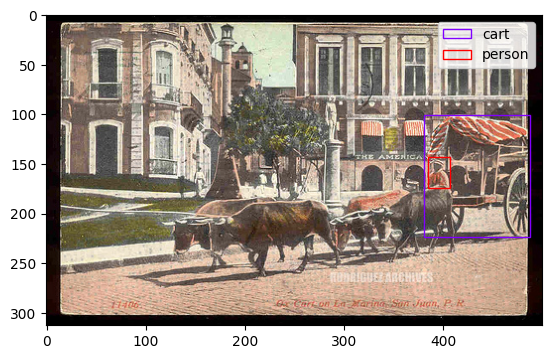

# Semi-Supervised Object Detection

This is the project for NYU DS-GA 1008 Deep Learning final project.

## Dataset

The dataset of this project can be downloaded at [[here]](https://drive.google.com/drive/u/1/folders/1EZxWpe66r4wclkQnrUmpp51FfK6gjE_d).
It is composed of 30,000 labeled train images, 20,000 labeled validation images, and 512,000 unlabeled images.

An example of image and labels is shown below,

## Backgrounds

### Supervised Object Detection

The traditional supervised object detection classification algorithms are as following,
* Two-stage methods (prioritize detection accuracy):
  * Region-based Convolutional Neural Network ([R-CNN](https://bdtechtalks.com/2021/06/21/object-detection-deep-learning/#:~:text=Object%20detection%20networks%20provide%20both,layers%20to%20detect%20visual%20features.))
  * Spatial Pyramid Pooling Network ([SPPNet](https://arxiv.org/abs/1406.4729))
  * [Fast R-CNN](https://arxiv.org/abs/1504.08083)
  * [Faster R-CNN](https://arxiv.org/abs/1506.01497)
* One-stage methods (prioritize inference speed):
  * You Only Look Once ([YOLO](https://arxiv.org/abs/1506.02640))
  * SSD
  * RetinaNet

### Semi-Supervised Object Detection

There are two main direction in utilizing unlabeled images,

1. Consistency Based Learning
2. Pseudo-label Based Learning

### Useful Link/Packages

* Microsoft [[MMDetection]](https://github.com/open-mmlab/mmdetection/blob/master/README_zh-CN.md)
* Facebook [[Detectron2]](https://github.com/facebookresearch/detectron2)
* Leaderboard [[Link]](https://paperswithcode.com/task/semi-supervised-object-detection)

## Our Approach

### Unbiased Teacher

#### Timeline

[11/12/2022] After reviewed many supervised and semi-supervised object detection models, we first decided to implement an [unbiased-teacher-2.0](https://github.com/facebookresearch/unbiased-teacher-v2).

[11/13/2022] We have modified the dataset label from `yml` format to `json` format. (Reference: `yml_to_jason.py`)

[11/14/2022] We started training _unbiased-teacher_ from **scratch** with using only 30000 labeled data and experimenting with a 99.9%  inferring the full dataset training. 

> _The idea failed_. Training with no pretrained teacher suffers from **gradient exploding** (not exactly, but metaphorically) since the prediction is too bad. The process often exit with error `FloatingPointError: Predicted boxes or scores contain Inf/NaN. Training has diverged.`.

[11/15/2022] We decided to change direction and train a supervised faster R-CNN first with the labeled data. Afterward, we use the model as the pretrained weight to train unbiased-teacher-2.0.

