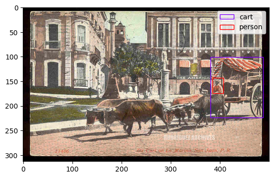

# Semi-Supervised Object Detection

This is the project for NYU DS-GA 1008 Deep Learning final project.

## Dataset

The dataset of this project can be downloaded at [[here]](https://drive.google.com/drive/u/1/folders/1EZxWpe66r4wclkQnrUmpp51FfK6gjE_d).
It is composed of 30,000 labeled train images, 20,000 labeled validation images, and 512,000 unlabeled images.

An example of image and labels is shown below,

## Approach

### Supervised Object Detection

The traditional supervised object detection classification algorithms are as following,
* Two-stage methods (prioritize detection accuracy):
  * Region-based Convolutional Neural Network ([R-CNN](https://bdtechtalks.com/2021/06/21/object-detection-deep-learning/#:~:text=Object%20detection%20networks%20provide%20both,layers%20to%20detect%20visual%20features.))
  * Spatial Pyramid Pooling Network ([SPPNet](https://arxiv.org/abs/1406.4729))
  * [Fast R-CNN](https://arxiv.org/abs/1504.08083)
  * [Faster R-CNN](https://arxiv.org/abs/1506.01497)
* One-stage methods (prioritize inference speed):
  * You Only Look Once ([**YOLO**](https://arxiv.org/abs/1506.02640))
  * SSD
  * RetinaNet

### Semi-Supervised Object Detection

There are two main direction in utilizing unlabeled images,

1. Consistency Based Learning
2. Pseudo-label Based Learning

