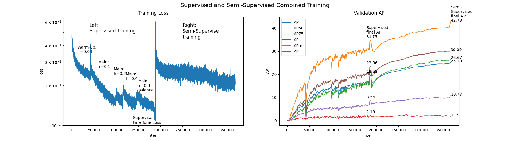

# Semi-Supervised Object Detection

This is the project for _NYU Fall 2022 DS-GA 1008 Deep Learning final competition_.

## Dataset

The dataset of this project can be downloaded at [[here]](https://drive.google.com/drive/u/1/folders/1EZxWpe66r4wclkQnrUmpp51FfK6gjE_d).
It is composed of 30,000 labeled train images, 20,000 labeled validation images, and 512,000 unlabeled images.

An example of image and labels is shown below,


## Backgrounds

### Supervised Object Detection

The traditional supervised object detection classification algorithms are as following,
* Two-stage methods (prioritize detection accuracy):
  * Region-based Convolutional Neural Network ([R-CNN](https://bdtechtalks.com/2021/06/21/object-detection-deep-learning/#:~:text=Object%20detection%20networks%20provide%20both,layers%20to%20detect%20visual%20features.))
  * Spatial Pyramid Pooling Network ([SPPNet](https://arxiv.org/abs/1406.4729))
  * [Fast R-CNN](https://arxiv.org/abs/1504.08083)
  * [Faster R-CNN](https://arxiv.org/abs/1506.01497)
* One-stage methods (prioritize inference speed):
  * You Only Look Once ([YOLO](https://arxiv.org/abs/1506.02640))
  * SSD
  * RetinaNet

### Semi-Supervised Object Detection

There are two main direction in utilizing unlabeled images,

1. Consistency Based Learning
2. Pseudo-label Based Learning

### Useful Link/Packages

Microsoft [[MMDetection]](https://github.com/open-mmlab/mmdetection/blob/master/README_zh-CN.md), Facebook [[Detectron2]](https://github.com/facebookresearch/detectron2), Leaderboard [[Link]](https://paperswithcode.com/task/semi-supervised-object-detection)

Detectron2

## Our Approach

### Unbiased Teacher

#### Timeline

[11/12/2022] After reviewed many supervised and semi-supervised object detection models, we first decided to implement an [unbiased-teacher-2.0](https://github.com/facebookresearch/unbiased-teacher-v2).

[11/13/2022] We have modified the dataset label from `yml` format to `json` format. (Reference: [`yml_to_jason.py`](https://github.com/HaowenGuan/NYU-Deep-Learning-Final-Project/blob/main/yml_to_json.py))

[11/14/2022] We started training _unbiased-teacher_ from **scratch** with using only 30000 labeled data and experimenting with a 99.9%  inferring the full dataset training. 

> _The idea failed_. Training with no pretrained teacher suffers from **gradient exploding** (not exactly, but metaphorically) since the prediction is too bad. The process often exit with error `FloatingPointError: Predicted boxes or scores contain Inf/NaN. Training has diverged.`.

[11/15/2022] We decided to change direction and train a supervised faster R-CNN first with the labeled data. Afterward, we use the model as the pretrained weight to train unbiased-teacher-2.0.

**Supervised faster R-CNN + FPN training on 30000 labeled data. Initial weight from scratch. Command:**

```cmd
python detection/tools/train_net.py --num-gpus 6 --config-file ../../configs/supervised-RCNN/faster_rcnn_R_50_FPN_3x.yaml
```

[11/16/2022] ~ [11/18/2022] Implement the function to migrate the weights from supervised R-CNN model to semi-supervised model and using it as pretrain weight for unbiased teacher. Investigated the learning_rate configuration of training supervised faster R-CNN. The model is still suffering from gradient exploding even the current AP is about ~3. We have trained for $140000 \text{ iteration} \equiv 8400000 \text{ images throughput} \equiv 280 \text{ NYU dataset Epochs}$ with a gradually increasing learning rate`lr = 0.004, 0.01, 0.02, 0.04` (_to balance between gradient exploding and training time_) and `batch_size=60` using `6 x RTX A6000` for `24 hrs` and achieved `AP=15.5`.


[11/19/2022] We observe the labeled dataset is imbalanced, which lead our model to bias toward **majority** classes. To overcome this, we used `RepeatFactorTrainingSampler` to balance samples. Continuing supervised training. Our final fine-tuned supervised model achieved `AP=19.5`. [**[Download Model Weight]**](https://drive.google.com/drive/folders/1e2BozQQjy5f5JCepU_C-38aI6aUcQ-l8?usp=sharing).


[11/20/2022] Finished training supervised model. Starting to train unbiased-teacher-2.0. We are sharing all the pretrained weights from supervised model to both teacher and student in the semi-supervised model. Based on the original paper, unbiased-teacher-2.0 trained about 16 coco dataset epoch to reach the final model. Since NYU unlabeled dataset has 512000 images, with using a `batch_size=18`, one NYU dataset epoch throughput is equivalent to `iter=28500` training. Therefore, in equivalent to 16 dataset epoch, we would need to train a total `iter=450000`. It is a bit too much, so we are currently aiming at training for `iter=150000~225000`. The training logs can be found in `output` folder with figured in [**[Log Figure]**](https://github.com/HaowenGuan/NYU-Deep-Learning-Final-Project/blob/main/output/training_figure_demo.ipynb).

[11/22/2022] Finished training unbiased teacher. The raw model (not fine-tuned) achieved `AP=23.5`. We proceed fine-tuning in two ways:
1. Convert the teacher weight back to supervised model, then do the fine-tuning in supervised training manner. **Result: the final supervised model achieved `AP=25`.**
2. Do the fine-tuning using unbiased teacher with a gradually decreasing learning-rate `lr = 0.008, 0.004, 0.001`. **Result: the final semi-supervised model achieved `AP=25`.**



## How to run eval.py

Change `config_file` in `model.py` to the path of your config yaml file. In your config yaml file, change `WEIGHTS` point to your model path. In `eval.py`, change `VALID_DATASET_PATH` to your validation dataset path. Then just run

```cmd
python eval.py
```

Note: I made some changes in _ubteacher/modeling/meta_arch/rcnn.py_. Not sure whether this will affect the training process. Also if your prediction is empty, this will make eval.py broken.

## How to Convert pth Model to pkl Weight

Modify the config file to point to your weight path. Then run,

```cmd
python save_to_pkl.py
```


## How to USE

### Clone Repo

```cmd
git clone git@github.com:HaowenGuan/NYU-Deep-Learning-Final-Project.git
cd NYU-Deep-Learning-Final-Project
```

* **(Optional)** Clone Detectron2 Repo,

```cmd
git clone git@github.com:facebookresearch/detectron2.git
```

### Run Supervised RCNN FPN

#### Training

Make sure you have cloned detectron2 for this part. Register your objected detection dataset in `detectron2/tools/train_net.py` with code like,

```python
# register NYU dataset
from detectron2.data.datasets import register_coco_instances
register_coco_instances("nyu_train", {}, "/data/sbcaesar/nyu/labeled_data/annotation/labeled_train.json", "/data/sbcaesar/nyu/labeled_data/train2017")
register_coco_instances("nyu_val", {}, "/data/sbcaesar/nyu/labeled_data/annotation/labeled_val.json", "/data/sbcaesar/nyu/labeled_data/val2017")
```

Then run,

```cmd
python detectron2/tools/train_net.py --config-file ../../configs/supervised-RCNN/faster_rcnn_R_50_FPN_3x.yaml --num-gpus 6
```

Tuning `STEPS, MAX_ITER, IMS_PER_BATCH, CHECKPOINT_PERIOD, BASE_LR, WARMUP_FACTOR, WARMUP_ITERS` by yourself in the config file.

#### Testing

Modify the config file `configs/supervised-RCNN/supervised_evaluation.yaml` to point to your weight path. Make sure the test dataset path is set correctly in the config file and registered in train_net.py. Then run,

```cmd
python detectron2/tools/train_net.py --eval-only --config-file ../../configs/supervised-RCNN/supervised_evaluation.yaml --num-gpus 6
```

### Run Unbiased-Teacher-2.0

#### Training

Modify the config file to point to your weight path. Modify the dataset path in`unbiased_teacher_train.py` and `ubteacher/data/datasets/builtin` to point to labeled dataset and unlabeled dataset. Then run,

```cmd
python unbiased_teacher_train.py --config configs/Faster-RCNN/nyu/faster_rcnn_R_50_FPN_ut2.yaml --num-gpus 6
```

#### Testing

Modify the config file `configs/Faster-RCNN/nyu/semi_supervised_evaluation.yaml` to point to your weight path. Make sure the test dataset path is set correctly in the config file and registered correctly in`unbiased_teacher_train.py`. 

> (Optional: Convert the checkpoint `.pth` model to `.pkl` to do evaluation if you trained your own model. Run,
> ```
> python save_to_pkl.py --save_semi_eval
> ```

Then run the testing command,

```cmd
python unbiased_teacher_train.py --eval-only --config configs/Faster-RCNN/nyu/semi_supervised_evaluation.yaml --num-gpus 6
```


